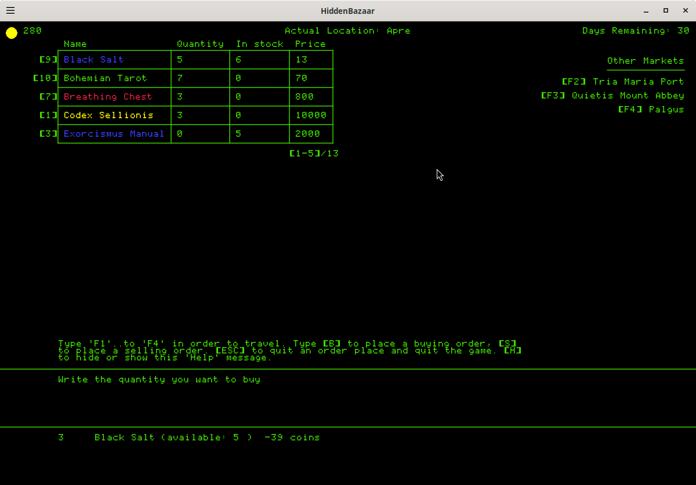

# HiddenBazaar

***Copyleft (ɔ) 2026 Jojopov (Franz Bonaparta)***

See [License : GNU GPLv3 or later](https://www.gnu.org/licenses/)

>This program is free software: you can redistribute it and/or modify
>it under the terms of the GNU General Public License as published by
>the Free Software Foundation, either version 3 of the License, or
>(at your option) any later version.
>
>This program is distributed in the hope that it will be useful,
>but WITHOUT ANY WARRANTY; without even the implied warranty of
>MERCHANTABILITY or FITNESS FOR A PARTICULAR PURPOSE.***

⚠️**The game is currently under development** it is not fully operational and many features are still missing!

## About

**HiddenBazaar** is a small **old-school trading game** focused on **occult and esoteric resources**.

Travel between isolated markets, buy strange artifacts, grimoires and ritual objects, then resell them in places where demand is higher.

The game is heavily inspired by:

- old **DOS** / **Apple II** trading games,
- **terminal-like interfaces**,
- retro **management** games,
- **occult folklore** and pseudo-esoteric artifacts.

The project intentionally focuses on:

- **lightweight UI**,
- **keyboard-driven** interaction,
- **data-oriented** structures,
- and **minimalistic presentation**.

---

## ⚙️ Current Features

- Multiple markets with local price modifiers
- Buy / sell system
- Inventory management
- Travel system with remaining days
- Scrollable market view
- Rare and cursed occult resources
- Keyboard-only navigation
- Dynamic stock quantities

---

## 🕹️ Controls

| Key | Action |
|---|---|
| `F1` → `F4` | Travel between markets |
| `B` | Buy mode |
| `S` | Sell mode |
| `H` | Show / hide help |
| `Enter` | Validate input |
| `Backspace` | Delete character |
| `Mouse Wheel` | Scroll market articles |
| `Escape` | Cancel current action / quit |

---

## 🕯️Philosophy

**HiddenBazaar** is designed as a compact and experimental project.

**The goal is not realism, but atmosphere**:
markets filled with suspicious relics, strange grimoires and forgotten objects whose origins remain uncertain.

Many resources are inspired by folklore, religious artifacts, occult symbolism and pseudo-historical curiosities.

---

## 🛠 Tech

- **Language: Lua**
- **Framework: Löve2D**
- **Platform: Linux** (primary development platform)

---

## 🔭 Planned Features

- Dynamic prices influenced by stock levels
- Event system
- Rumors and market information
- Expanded resource pool
- Additional locations
- Better prompt / terminal interactions

---

## 🖋️ Author

Created by **Jojopov** (**Franz Bonaparta**).

Open-source and designed as a lightweight experimental retro project.